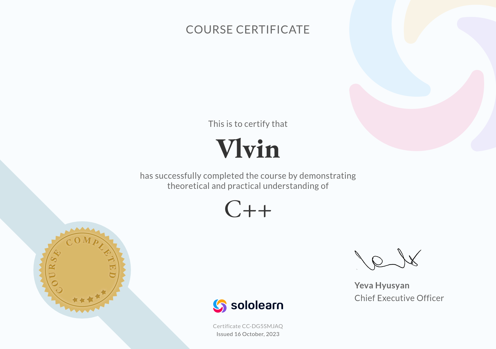

# Vladimir Golovin 

  
  <text>ghostv.work@gmail.com</text> 

  
  <text>+995 574 23 21 59</text> 

  
  <text><a href="https://github.com/Vlvin">github.com/Vlvin</a></text> 

  
  <text><a href="https://t.me/GOTV3454">@GOTV3454</a></text> 

### Summary
- Versatile tech stack
- Ability to learn fast
- Passion to code :)

### Courses
- Sololearn | C++ --- October 2023
- Itransition training | Commertial Software Development --- Jan 2025 - Mar 2025

### Experience
##### ITransition -- Web Developer Intern &emsp; Jan 2025 --- Mar 2025
- Performed various tasks
- Developed full-stack application

### Projects  
**GhostForms App** | ASP.NET (C#), React (JS), Docker | [GitHub Repository](https://github.com/Vlvin/GFS_Docker.git) &emsp; **Mar 2025 --- Mar 2025**
- Started Full-stack application for ITransition internship
- Created UI using React and Bootstrap framework
- Implemented backend with ASP.NET
- Docker for deployment

**Clocks Virtual Machine** | C | [GitHub Repository](https://github.com/Vlvin/CLocksVM.git) &emsp; **Oct 2024 --- Present**  
- Creating simple bytecode machine and compiler for Clocks programming language.
  Also researching corresponding tecnologies and algorithms (e.g. Bytecode machine, Hash Table)

**Clocks Interpreter** | C++ | [GitHub Repository](https://github.com/Vlvin/clocks.git) &emsp; **Sep 2023 --- Feb 2024**
- Developed Clocks language interpreter from the ground up. Performed optimization on return statement which resulted in 95% reduced execution time. Also filled std library with I/O and Math functionality

### Technical Skills
- **Programming Languages**: C, C++, C#, Python, Java, HTML, JavaScript, SQL
- **Build Tools**: CMake, Gradle
- **Software Development**: Object-Oriented Programming (OOP), SOLID Principles, Design Patterns, Data Structures and Algorithms
- **CI/CD**: Git, Docker

### Extracurricular / Certifications:
  

